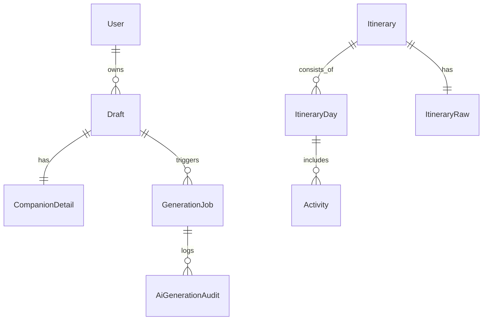

# shin-travelin 基本設計（精緻化・完全版）

本書は要件定義を踏まえ、アーキテクチャ、UX、API 契約、データ、生成パイプライン、非機能、運用、テストまでを抜け漏れなく示す。実装詳細は detail-design を補完参照する。

## 0. 前提・環境

### プロダクト段階
- フェーズ：**MVP → 本番運用想定**
- 方針：機能検証段階から **可用性・監査性を重視**
- 想定スケール：**中程度（個人〜小規模チーム利用）**

---

### フロントエンド

| 項目 | 採用技術 |
|----|----|
| フレームワーク | **Next.js 15** |
| ルーティング | App Router |
| レンダリング | RSC（React Server Components） |
| ランタイム | Node.js 20 |
| 主な責務 | フォーム入力、旅程表示、部分再生成 UI、SSR 一覧表示、アクセシビリティ対応 |

---

### サーバー / API（バックエンド）

| 項目 | 採用技術 |
|----|----|
| フレームワーク | **NestJS 11** |
| API 方式 | REST |
| ORM | **Prisma 7（PostgreSQL Driver Adapter 方式）** |
| ランタイム | Node.js 20 |
| 主な責務 | 認証、Draft/Itinerary 管理、生成ジョブ制御、競合検知、監査ログ記録 |

---

### 生成 / AI

| 項目 | 採用技術 |
|----|----|
| LLM | **Gemini** |
| 生成単位 | 日単位生成 → 集約 |
| 検証 | Zod による構造検証 |
| 安定化対応 | 再試行制御、部分成功保持、生成履歴の再利用 |
| 監査 | prompt / response / error / retryCount / correlationId を保存 |

---

### データベース

| 項目 | 採用技術 |
|----|----|
| DBMS | **PostgreSQL 15** |
| 接続方式 | Prisma Driver Adapter |
| 永続化 | **永続ボリューム必須** |
| 主な役割 | ユーザー、下書き、旅程、生成ジョブ、監査ログの永続化 |

---

### デプロイ / 実行環境

| 項目 | 内容 |
|----|----|
| コンテナ構成 | Front / Back(API) / DB を **個別コンテナ**で分離 |
| コンテナランタイム | Docker |
| シークレット管理 | 環境変数による管理（DB 接続情報、LLM API Key 等） |
| 構成方針 | アプリ層と DB 層を分離し、再デプロイ時もデータを保持 |


## 1. システム構成と依存方向

### 全体方針
- 表示層・業務ロジック・永続化・生成処理を明確に分離し、**責務ごとの変更影響範囲を限定**する。
- LLM 呼び出しは生成パイプラインに集約し、**再試行・部分成功・監査を一元管理**する。

---

### フロントエンド構成

- **Next.js（App Router + RSC）** を用いて SSR / SSG を実施する。
- クライアント側では、フォーム入力、旅程編集、部分再生成など **ユーザー操作が必要な処理のみ**を担当する。
- 共通モジュールは以下に集約する：
  - `shared/api`：API 呼び出し用の fetch ラッパー
  - `shared/validation`：Zod による入力・レスポンス検証
  - `shared/ui`：再利用可能な UI コンポーネント
  - `shared/lib/queryClient`：データ取得・キャッシュ制御

---

### バックエンド構成

- **Controller → Service → Prisma** のレイヤード構成を採用する。
  - Controller：API 境界・認可・入力受付
  - Service：ユースケース実装・トランザクション制御
  - Prisma：永続化（PostgreSQL）
- 横断的な関心事は NestJS の仕組みで統一的に処理する：
  - ValidationPipe（`whitelist / forbidNonWhitelisted / transform`）
  - HttpExceptionFilter（例外の統一変換）
  - LoggingInterceptor（リクエスト / レスポンスログ）
  - JWT Guard（認証・認可）

---

### 生成（AI）構成

- 生成処理は **`ai.pipeline` に一極集中**させ、以下の手順で実行する：
  1. Draft データを正規化
  2. プロンプト生成
  3. Gemini API 呼び出し（指数バックオフによる再試行）
  4. 日単位の生成結果を検証・部分成功として保持
  5. 生成結果および監査情報を永続化
     - `AiGenerationAudit`
     - `Itinerary`
     - `ItineraryRaw`

---

### データベース構成

- 正規化データと生データを役割分離して保持する：
  - 正規化：`Itinerary / ItineraryDay / Activity`
  - 生データ：`ItineraryRaw / AiGenerationAudit`（JSONB）
- `Draft` は TTL 管理とし、一定期間後に自動削除する。
- `GenerationJob` により、生成処理の進捗・再試行回数・状態を管理する。

---

### 依存方向

- 依存関係は以下の **一方向**とすることで循環依存を防止する：
  - UI → hooks/api → shared(api/validation) → REST → Nest(Service) → Prisma → PostgreSQL
- LLM 呼び出しは **`ai.pipeline` に一極集中**させ、他のモジュールから直接呼び出さない。


### システム構成図

```mermaid
flowchart LR
  browser[Browser]
  next[Next.js<br/>(App Router / RSC)]
  nest[NestJS API]
  prisma[Prisma 7<br/>PostgreSQL Adapter]
  postgres[(PostgreSQL)]
  gemini[Gemini API]
  logs[Audit / Logs]

  browser -->|HTTPS| next
  next -->|REST<br/>/auth /drafts /ai /itineraries| nest
  nest --> prisma
  prisma --> postgres
  nest -->|HTTPS| gemini
  nest --> logs
```


## 2. 画面・UX・状態管理（App Router）

### 2.1 一覧画面

- **`/itineraries`**
  - サーバーコンポーネント（SSR）で旅程一覧を取得する。
  - データが存在しない場合は、空状態を示すプレースホルダーを表示する。
  - 取得に失敗した場合は、再読み込みボタンを表示する。
  - 一覧の各行をクリックすると、対応する旅程の詳細画面へ遷移する。

---

### 2.2 詳細・編集画面

- **`/itineraries/[id]`**
  - 初期表示はサーバーコンポーネント（SSR）で旅程データを取得する。
  - 編集操作はクライアントコンポーネントで行う。
  - 編集可能項目：
    - タイトル（1–120文字）
    - Activity（時刻 / エリア / placeName / カテゴリ / 内容 / 滞在目安 / 天気）
  - 日付情報は表示専用とし、編集不可とする。
  - 保存時は PATCH API を使用し、**version を必須とする楽観的ロック**を行う。
  - 部分再生成は対象日（day 配列）を指定して実行し、生成ジョブの状態をポーリングで取得する。
  - 部分生成結果は、成功・未生成を視覚的に区別（色分け）して表示する。
  - 保存・生成処理中は、該当操作の UI を無効化する。

---

### 2.3 印刷・共有画面

- **`/itineraries/[id]/print`**
  - サーバーコンポーネント（RSC）のみで構成する読み取り専用画面とする。
  - 印刷および SNS 共有（OG 表示）を目的とする。
  - 編集用 UI は一切提供しない。

---

### 2.4 旅行条件入力画面

- **`/`**
  - 入力項目と制約：
    - 出発地：3–200文字
    - 目的地：1–5件（各 3–200文字）
    - 開始日 ≦ 終了日（最大 3 年以内）
    - 予算：5,000–5,000,000円
    - 旅行目的：1–5件
    - メモ：最大 500文字
    - 同行者人数：各カテゴリ 0–20人
  - フォーム管理は **React Hook Form + Zod** を使用する。
  - バリデーションエラー発生時は、**最初のエラーフィールドへ自動スクロール**する。
  - 送信フロー：
    1. Draft を保存
    2. `POST /ai/generate` を呼び出し生成ジョブを開始
    3. `jobId` を取得
    4. `/itineraries/[id]?jobId=...` へ遷移する
  - 送信処理中は入力・送信ボタンを無効化する。
  - 認証エラー（401）の場合は、ログイン導線を表示する。

---

### 2.5 認証（ログイン / 登録）

- **`/login`（モーダル表示を想定）**
  - 入力項目：
    - email
    - password（8文字以上）
    - displayName（1–50文字、登録時）
  - 認証・登録成功後はトップページ（`/`）へ戻す。
  - 認証 API にはレートリミットを適用する。

## 3. ドメインと制約

### 3.1 Draft（旅行条件の入力スナップショット）

- 旅行条件入力時点の **入力内容を保持するスナップショット**。
- `CompanionDetail` と **1 対 1** の関係を持つ。
- 保存期間は **7 日間（TTL 管理）** とし、期限経過後は自動削除対象とする。

**制約**
- 開始日 ≤ 終了日であること。
- 予算および旅行目的は必須入力とする。
- Draft は生成処理の入力専用であり、生成完了後も不変とする。

---

### 3.2 GenerationJob（生成ジョブ管理）

- AI 生成処理の実行単位を表すドメイン。
- Draft を起点に、生成の進捗・状態・再試行回数を管理する。

**主な属性**
- `draftId`
- `status`：`queued / running / succeeded / failed`
- `retryCount`
- `partialDays`：部分生成に成功した日付インデックス配列
- `error`：失敗理由（存在する場合）

**制約**
- 同一 Draft に対して **実行中（queued / running）の GenerationJob が存在する場合は新規生成不可**とし、409 を返却する。
- 状態遷移は一方向とし、`succeeded / failed` から他状態へは遷移しない。

---

### 3.3 Itinerary（生成結果・編集対象）

- AI 生成後にユーザーが閲覧・編集する **旅程の正規化データ**。
- 編集競合を防ぐため、**version による楽観的ロック**を採用する。

**制約**
- `Day` は「日付 + index」の組み合わせで一意とする。
- `Activity` は日付単位で保持し、表示・保存時は日付順に並べる。
- 時刻は `00:00 – 23:59` の範囲内とする。
- 日付情報自体は編集不可とする。

---

### 3.4 ItineraryRaw（生成元データ）

- LLM から返却された **生の JSON データ**を保持する。
- 正規化前・修復前の状態を含め、**監査およびトラブルシュート用途**で使用する。

**主な属性**
- `rawJson`
- `promptHash`
- `model`
- `generatedAt`

**制約**
- 監査目的のため **削除しない**。
- アプリケーションロジックから直接参照・編集しない。

---

### 3.5 AiGenerationAudit（生成監査ログ）

- LLM 呼び出しに関する **完全な実行履歴**を保持する監査ドメイン。

**記録内容**
- `prompt`
- `request`
- `response`
- `raw`
- `parsed`
- `retryCount`
- `status`
- `error`
- `correlationId`

**制約**
- すべての LLM 呼び出しは必ず Audit に記録する。
- 生成失敗・部分成功・再試行を含め、履歴は **不可逆・追記のみ**とする。


## 4. API 契約（前提条件 / 事後条件）

### 4.1 認証 API

| Method | Path | 入力 | 前提条件 | 事後条件 / 正常系 | 主なエラー |
|------|------|------|----------|------------------|-----------|
| POST | `/auth/register` | email, password(≥8), displayName(1–50) | なし | User を作成し JWT を発行する | 409: email 重複 |
| POST | `/auth/login` | email, password | なし | JWT を発行する | 401: 認証失敗 |

---

### 4.2 Draft API

| Method | Path | 入力 | 前提条件 | 事後条件 / 正常系 | 主なエラー |
|------|------|------|----------|------------------|-----------|
| POST | `/drafts` | CreateDraftDto | 入力検証済み | Draft と CompanionDetail を作成する（TTL 7 日） | 400: 開始日 > 終了日 |
| GET | `/drafts/:id` | – | 所有者のみ | Draft を返却する | 401 / 403 / 404 |

---

### 4.3 生成（AI）API

| Method | Path | 入力 | 前提条件 | 事後条件 / 正常系 | 主なエラー |
|------|------|------|----------|------------------|-----------|
| POST | `/ai/generate` | draftId, targetDays? | Draft が存在し、所有者であり TTL 内 | GenerationJob を `queued` 状態で作成し、監査を開始する | 409: 実行中ジョブあり |
| GET | `/ai/jobs/:id` | – | jobId が存在 | `{ status, retryCount, partialDays, error? }` を返却 | 404: 不明な jobId |

---

### 4.4 Itinerary API

| Method | Path | 入力 | 前提条件 | 事後条件 / 正常系 | 主なエラー |
|------|------|------|----------|------------------|-----------|
| POST | `/itineraries` | – | – | ※ 生成完了後は `ai.pipeline` が Itinerary / ItineraryRaw / Audit を自動保存するため、このエンドポイントは 410 を返却（手動作成不可） | 410 |
| GET | `/itineraries` | page, query | 認証済み | ページングされた一覧を返却 | 401 |
| PATCH | `/itineraries/:id` | title, days, version | 所有者かつ version 一致 | version を +1 して更新する | 409: 競合 |
| POST | `/itineraries/:id/regenerate` | days[] | 所有者、実行中なし | 再生成ジョブを開始し `{ jobId }` を返却 | 409: 実行中 |
| GET | `/itineraries/:id/print` | – | 認可済み | 読み取り専用 DTO を返却 | 401 / 403 |

---

### 4.5 共通レスポンス形式

すべての API は以下の形式でレスポンスを返却する。

```json
{
  "code": "string",
  "message": "string",
  "details": "object | null",
  "correlationId": "string"
}
```

- code：アプリケーション定義のエラーコード
-  message：ユーザーまたはログ向けの説明
- details：バリデーションエラー等の詳細（存在する場合）
- correlationId：ログ・監査追跡用 ID

## 5. データモデルとインデックス

### 5.1 エンティティ関係（リレーション）

- User は複数の Draft を持つ
- Draft は CompanionDetail と 1 対 1
- Draft は複数の GenerationJob を持つ
- Itinerary は複数の ItineraryDay を持ち、各 Day は複数の Activity を持つ
- Itinerary は ItineraryRaw と 1 対 1
- GenerationJob は複数の AiGenerationAudit を持つ



### 5.2 主な制約
| 対象            | 制約内容                                          |
| ------------- | --------------------------------------------- |
| ItineraryDay  | `(itineraryId, dayIndex, scenario)` の組み合わせをユニークとする      |
| Activity      | `(itineraryDayId, orderIndex)` の組み合わせをユニークとする |
| Itinerary     | `version` は整数型とし、更新ごとに `+1` される               |
| GenerationJob | 同一 Draft に対し、実行中（`queued` / `running`）は 1 件のみ |
| Draft         | 開始日 ≤ 終了日。TTL 管理対象                            |

### 5.3 JSONB カラムの用途
| テーブル              | カラム       | 用途                      |
| ----------------- | --------- | ----------------------- |
| ItineraryRaw      | `rawJson` | LLM から返却された生の生成結果（正規化前） |
| AiGenerationAudit | `request`  | LLM 呼び出しリクエスト（入力） |
| AiGenerationAudit | `rawResponse` | LLM 応答（出力・生データ） |
| AiGenerationAudit | `parsed`   | 構造検証・修復後のデータ |

### 5.4 インデックス設計
| テーブル              | インデックス                     | 目的            |
| ----------------- | -------------------------- | ------------- |
| Itinerary         | `(userId, createdAt DESC)` | 一覧表示の高速化      |
| GenerationJob     | `(draftId, status)`        | 実行中ジョブの判定     |
| AiGenerationAudit | `(jobId, createdAt)`       | 生成履歴の時系列参照    |
| Draft             | `(createdAt)`              | TTL 削除ジョブの効率化 |

### 5.5 データ保持方針（TTL / 保存期間）
| エンティティ            | 保持方針    | 理由         |
| ----------------- | ------- | ---------- |
| Draft             | 7 日後に削除 | 入力途中データの整理 |
| GenerationJob     | 削除しない   | 生成履歴の追跡    |
| Itinerary         | 削除しない   | ユーザー資産     |
| AiGenerationAudit | 削除しない   | 監査・再解析要件   |


## 6. セキュリティ・認証・認可

### 6.1 認証（Authentication）

- 認証方式は **JWT（Bearer Token）** を採用する。
- フロントエンドからの利用形態に応じて、**HTTP Only Cookie での運用もオプションとして許容**する。
- 認証関連 API（`/auth/register`, `/auth/login`）には **レートリミット**を適用し、総当たり攻撃を防止する。

---

### 6.2 認可（Authorization）

- すべての業務データは **userId スコープ**でアクセス制御を行う。
  - Draft / Itinerary は作成者本人のみ参照・更新可能
  - 再生成（`/itineraries/:id/regenerate`）も作成者本人のみ実行可能
- 認可チェックは Controller レイヤで行い、不正アクセス時は 403 を返却する。

---

### 6.3 シークレット管理

- DB 接続情報、JWT Secret、LLM API Key などの機密情報は **すべて環境変数で管理**する。
- ソースコードおよびリポジトリへの **ハードコードは禁止**する。
- ログ出力時にシークレットが混入しないよう、マスキングまたは出力抑制を行う。

---

### 6.4 入力検証・不正入力対策

- サーバー側の入力検証は以下を併用する：
  - **class-validator**：DTO レベルのバリデーション
  - **Zod**：構造・型の厳密な検証（特に AI 生成結果）
- NestJS の `ValidationPipe` にて以下を有効化する：
  - `whitelist: true`（定義外プロパティの除外）
  - `forbidNonWhitelisted: true`（不正プロパティをエラー）
  - `transform: true`（型変換）

---

### 6.5 CORS / CSRF 対策

- API は **許可されたオリジンのみ CORS を許可**する。
- JWT を Authorization Header で利用する場合は、CSRF 対策は不要とする。
- Cookie 認証を利用する場合は以下を適用する：
  - `SameSite=Lax` または `SameSite=Strict`
  - `Secure` 属性を有効化
- 状況に応じて、将来的に CSRF トークン方式の導入を検討する。

---

## 7. ログ / 監視 / アラート

### 7.1 ログ設計

- すべての API リクエスト / レスポンスについて、**構造化 JSON ログ**を出力する。
- ログは機械可読性を優先し、検索・集計・相関追跡を容易にする。

**共通ログ項目**
- `method`：HTTP メソッド
- `path`：リクエストパス
- `status`：HTTP ステータスコード
- `latency_ms`：処理時間（ミリ秒）
- `requestId`：リクエスト単位の一意 ID
- `userId`：認証済みユーザー ID（存在する場合）
- `correlationId`：生成処理・監査追跡用 ID

**生成（LLM）関連ログの追加項目**
- `promptHash`：生成条件を表すハッシュ
- `retryCount`：再試行回数
- `jobId`：対応する GenerationJob ID
- `model`：使用した LLM モデル（必要に応じて）

---

### 7.2 メトリクス設計

以下の主要な数値指標を収集し、システムの健全性を監視する。

| メトリクス名 | 内容 |
|----|----|
| `api_latency_ms` | API レスポンス時間 |
| `prisma_query_ms` | Prisma 経由の DB クエリ実行時間 |
| `job_duration_seconds` | 生成ジョブの実行時間 |
| `ai_retry_count` | LLM 呼び出し時の再試行回数 |
| `ai_failure_rate` | LLM 生成失敗率 |
| `queue_depth` | 生成ジョブキューの滞留数 |

---

### 7.3 アラート設計

運用上の異常を早期に検知するため、以下の条件でアラートを発火する。

| 対象 | 条件 | 意図 |
|----|----|----|
| API エラー | 5xx 率 > 2%（5分間） | サーバー障害の検知 |
| 生成失敗 | 生成失敗率 > 10% | LLM 応答不安定の検知 |
| DB 性能 | Prisma クエリ 95 パーセンタイル > 500ms | DB 負荷・インデックス不足の検知 |
| ジョブ滞留 | 生成ジョブ滞留時間 > 5 分 | キュー詰まり・処理遅延の検知 |

---

### 7.4 運用方針

- アラートは **即時対応が必要なものに限定**し、過剰通知を避ける。
- `correlationId` を用いて、**ログ・メトリクス・監査データを横断的に追跡可能**とする。
- 初期段階では閾値を保守的に設定し、実運用データに基づいて段階的に調整する。


## 8. フロント実装方針

### 8.1 フェッチ / API クライアント

- API 通信は `shared/api/client.ts` に集約した fetch ラッパーを使用する。
- 共通仕様：
  - タイムアウト：10 秒
  - 再試行：最大 3 回（指数バックオフ）
  - 409（競合）および 422（検証エラー）は再試行せず即時失敗とする
- API の戻り値は以下の情報を含む共通レスポンス形式とする：
  - **status**：HTTP ステータスコード
  - **code**：アプリケーション定義のエラーコード
  - **message**：ユーザーまたはログ向けの説明文
  - **correlationId**：ログ・監査追跡用の相関 ID

- `correlationId` は UI 上でも参照可能とし、エラー発生時の問い合わせ・トラブルシュートに利用する。

---

### 8.2 状態管理方針

- サーバー由来データは **React Query** を主として管理する。
- **Zustand** は以下に限定して使用する：
  - 編集中フォームの一時状態
  - ページ遷移をまたぐ UI 状態（未保存フラグ等）
- React Query の代表的な Query Key は以下とする：
  - `['draft', id]`
  - `['ai-job', jobId]`
  - `['itineraries', userId, page, query]`
  - `['itinerary', id]`

---

### 8.3 SSR / RSC の使い分け

- 一覧画面および詳細画面の初期表示は **RSC（Server Components）でデータ取得**を行う。
- クライアント側では、RSC の取得結果をハイドレーションして表示を継続する。
- データ更新（Mutation）は **クライアントコンポーネントのみ**で実行する。

---

### 8.4 フォーム実装

- フォーム管理には **React Hook Form + ZodResolver** を使用する。
- 実装方針：
  - 送信中は入力欄および送信ボタンを無効化する
  - バリデーションエラー発生時は **最初のエラーフィールドへ自動スクロール**する
  - API エラーはトースト表示し、フィールド単位のエラーは対応する入力項目にマッピングして表示する

---

### 8.5 UI 状態分岐・ローディング制御

- UI は以下の状態に応じて明確に出し分ける：
  - `isLoading`：スケルトン UI を表示
  - `isError`：エラー表示および再試行導線を表示
  - `data`：メインコンテンツを表示
- 生成ジョブの状態確認は **ポーリング**で行う：
  - 初期間隔：2 秒
  - 最大間隔：8 秒（指数バックオフ）

---

### 8.6 二重実行防止と楽観更新

- `/ai/generate` 実行中に再度生成リクエストが送信された場合：
  - サーバーは 409（競合）を返却する
  - フロントエンド側でも送信ボタンを無効化し、二重送信を防止する
- 保存処理は **楽観的更新**を行い、失敗時はロールバックする。
- version 不一致による競合が発生した場合は、最新データを再取得し、差分をユーザーに提示する。


## 9. バックエンド実装方針

### 9.1 アーキテクチャ構成

- レイヤードアーキテクチャを採用する。
  - **Controller**：API 境界。リクエスト受付・認証認可・レスポンス整形を担当
  - **Service**：ユースケース実装。業務ロジック・競合判定・トランザクション制御を担当
  - **Prisma（Repository）**：永続化処理を担当
- DTO は `*.dto.ts` として定義し、入力バリデーションには **class-validator** を使用する。
- 例外処理は **HttpExceptionFilter** に集約し、エラーレスポンス形式を統一する。

---

### 9.2 認証・リクエスト管理

- 認証方式は **JWT Strategy（Passport）** を採用する。
- `AuthGuard` により `/auth` 配下以外の API を保護する。
- 各リクエストにはミドルウェアで **requestId** を付与し、ログおよび監査と紐付ける。

---

### 9.3 Prisma / 永続化方針

- 論理削除は行わず、削除対象は物理削除とする。
- 以下の処理のみトランザクションを使用する：
  - Itinerary / ItineraryDay / Activity の生成・保存
  - Itinerary 更新時の version インクリメント
- Activity の保存は **createMany** を用いてまとめて書き込む。
- Itinerary の更新には **version による楽観的ロック**を適用する。

---

### 9.4 生成ジョブ実行方針

- 生成ジョブは当初 **プロセス内で同期的に管理**する。
- LLM（Gemini）呼び出しは指数バックオフ付きで実行する。
- ハング検知や自動再実行については、将来的に **cron ベースの仕組み**を追加する余地を残す。
- 将来のキュー化・ワーカー分離を見据え、生成処理は専用サービス（ai.pipeline）に集約する。
---

## 10. リトライ・タイムアウト・可用性

### 10.1 フロントエンド側

- fetch 通信のタイムアウトは **10 秒**とする。
- 通信失敗時の再試行は **指数バックオフ**を用いる：
  - 1 回目：0.5 秒
  - 2 回目：1 秒
  - 3 回目：2 秒
- 以下のステータスコードの場合は **再試行を行わず即時失敗**とする：
  - 409（競合）
  - 422（入力検証エラー）
- 生成ジョブの状態確認（`/ai/jobs/:id`）はポーリングで行い、  
  **2 秒 → 最大 8 秒まで指数的に間隔を延ばす**。

---

### 10.2 バックエンド側

- LLM（Gemini）呼び出しのタイムアウトは **15 秒**とする。
- LLM 呼び出し失敗時は、以下の間隔で再試行を行う：
  - 1 回目：1 秒
  - 2 回目：3 秒
- Prisma のコネクションプールにはタイムアウト設定を行い、  
  DB 接続枯渇時の影響を限定する。
- 生成ジョブが最終的に失敗した場合は：
  - `status = failed` とする
  - エラー内容を **AiGenerationAudit** に記録する
  - クライアントには失敗状態を返却する

---

### 10.3 再利用による可用性・コスト最適化（検討事項）

- 同一条件での再生成を避けるため、以下の情報を組み合わせた **入力ハッシュ**を用いる案を検討する：
  - `draftId`
  - `promptHash`
  - `model`
  - `temperature`
- 上記ハッシュで **成功済みの生成結果が存在する場合**は、
  新規に LLM を呼び出さず既存結果を再利用することで、
  可用性向上および LLM コスト削減を図る。

## 11. 非機能要件

### 11.1 可用性

- API の月間稼働率は **99%** を目標とする。
- 生成処理および再生成処理については、多少の遅延は許容する。
- ただし、生成失敗や遅延が発生した場合は、**必ずユーザーに状態を可視化**し、エラー内容や再試行導線を提供する。

---

### 11.2 性能

- ページの初期表示時間は以下を目標とする：
  - 50 パーセンタイル：**2.5 秒未満**
- API レスポンス性能は以下を満たすこと：
  - 95 パーセンタイル：**500 ミリ秒未満**
- 生成処理（LLM 呼び出し含む）は以下を目標とする：
  - **30 秒以内に完了**すること

---

### 11.3 スケーラビリティ

- 1 ユーザーあたり **最大 100 件の旅程（Itinerary）** を保持可能とする。
- 生成リクエストは、ピーク時において **1 分あたり約 10 件**の処理を想定する。
- 将来的なユーザー増加に備え、生成処理のキュー化・ワーカー分離が可能な構成を前提とする。

---

### 11.4 バックアップ・データ保持

- データベースは **24 時間ごとにスナップショットバックアップ**を取得する。
- 以下のデータは監査・再解析用途のため保持する：
  - `ItineraryRaw`
  - `AiGenerationAudit`
- 上記監査系データは、ユーザー操作による削除対象外とする。


## 12. 運用・移行

### 12.1 マイグレーション運用

- スキーマ変更は **Prisma migrate deploy** を用いて適用する。
- マイグレーション失敗時は以下の手順で復旧する：
  - `prisma migrate resolve --rolled-back` により状態をロールバック
  - 事前取得している DB バックアップをリストア
- 本番環境では手動実行を避け、CI/CD パイプライン経由でのみ実行する。

---

### 12.2 TTL ジョブ運用

- Draft は作成から **7 日経過したものを削除対象**とする。
- TTL 処理は定期ジョブ（cron 等）で実行する。
- GenerationJob は履歴・監査目的のため **削除対象外**とする。

---

### 12.3 監査データの取り扱い

- 以下の監査テーブルについては **DELETE および TRUNCATE を禁止**する：
  - `AiGenerationAudit`
  - `ItineraryRaw`
- 監査データは不具合調査・再解析・説明責任のために保持する。
- バックアップポリシーに従い、監査データもスナップショット対象に含める。

---


## 13. テスト戦略

### 13.1 単体テスト（Unit Test）

- 以下のコンポーネントを対象に単体テストを実施する：
  - DTO および `class-validator` による入力検証
  - Zod スキーマ（生成結果・API レスポンス）
  - プロンプト生成ロジック（prompt builder）
  - Service 層の業務ロジック（分岐・競合判定・例外処理）
- 外部依存（DB・LLM）はモックまたはスタブ化し、純粋なロジック検証に集中する。

---

### 13.2 統合テスト（Integration Test）

- Controller と Prisma を含めた **API 単位の結合テスト**を実施する。
- テスト用の PostgreSQL（ローカルまたはコンテナ）を使用する。
- `/ai/generate` に関しては、LLM クライアント（Gemini）をモックし、以下を検証する：
  - GenerationJob の状態遷移
  - 監査ログ（AiGenerationAudit）の保存
  - 部分成功・失敗時の挙動

---

### 13.3 E2E テスト

- **Playwright** を用いて、ユーザー視点での主要フローを検証する。
- 対象シナリオ例：
  - ログイン
  - 旅行条件入力
  - AI 生成実行
  - 行程の保存
  - 再編集および再保存
- フロント・バックエンドを含めた実環境に近い形でテストを行う。

---

### 13.4 API 契約テスト（Contract Test）

- OpenAPI（Swagger）定義と Zod 型定義を **スナップショット比較**し、乖離がないことを確認する。
- AI 生成レスポンスについても、JSON Schema による検証を行い、構造破壊を検知する。

---

### 13.5 リグレッションテスト

- 過去に不具合が発生しやすい以下のケースを重点的にテストする：
  - version 不一致による競合（409）
  - 部分生成成功（partialDays）
  - タイムアウト発生時の挙動
  - 認証エラー（401）
  - レートリミット・過剰リクエスト（429）
- 新機能追加時には、既存テストを必ず再実行し、回帰不具合を防止する。

